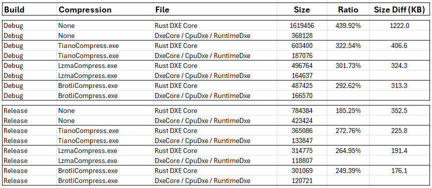

# QEMU DXE Core Binaries

## Overview

The main purpose of this repository is to integrate the Rust components and dependencies necessary to build a sample
Rust DXE Core binary that can be used in a QEMU UEFI firmware build.

Currently, two QEMU platforms are supported, Q35 for x64 architecture and SBSA for aarch64 architecture.

## Building

To build an executable, this repo uses the same compiler setup steps that are used in the patina project
[readme.md file build section](https://github.com/OpenDevicePartnership/patina#Build).  Once the compiler is installed,
executing cargo make will create a DXE core .EFI file that can be used as a replacement for the dxe core driver in the
[patina-qemu](https://github.com/OpenDevicePartnership/patina-qemu) UEFI build.

- Q35 (x64) debug

   ```shell
   Compile Command:  'cargo make q35'
   Output File:      'target/x86_64-unknown-uefi/debug/qemu_q35_dxe_core.efi'
   ```

- Q35 (x64) release

   ```shell
   Compile Command:  'cargo make q35-release'
   Output File:      'target/x86_64-unknown-uefi/release/qemu_q35_dxe_core.efi'
   ```

- SBSA (aarch64) debug

   ```shell
   Compile Command:  'cargo make sbsa'
   Output File:      'target/aarch64-unknown-uefi/debug/qemu_sbsa_dxe_core.efi'
   ```

- SBSA (aarch64) release

   ```shell
   Compile Command:  'cargo make sbsa-release'
   Output File:      'target/aarch64-unknown-uefi/release/qemu_sbsa_dxe_core.efi'
   ```

## Size Comparison

The code in both C and Rust modules is always changing and depending on compression used, size comparisons between the
Rust and C modules can be difficult.  But to give a general idea where current development stands, this Q35 build was
compiled both as debug and release, then compared to a Q35 build that contains the normal C based DXE core.  Note
the Rust core includes performance tracing and support normally provided by the CpuDxe and RuntimeDxe drivers, so that
was included in the size comparison.



## NuGet Publishing

This repository has a GitHub action to build and publish the output .EFI files to a public NuGet package feed
[qemu-dxe-core](https://dev.azure.com/patina-fw/artifacts/_artifacts/feed/qemu-dxe-core).  That feed is then consumed
by the [patina-qemu](https://github.com/OpenDevicePartnership/patina-qemu) repository to demonstrate a UEFI
build that uses the Rust DXE core driver.
